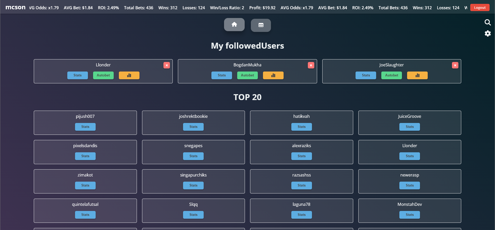

# Stake-Bot-Web



[French](README.md)

## Introduction

This project is a betting tracking system for stake.com, allowing users to track other users' bets in real-time, view bettor statistics, and much more. It includes a web interface and notifications for bet updates.

## Features

- Real-time bet tracking.
- Display of user statistics and graphs.
- Notifications for bet updates.

## Installation

You need this project for it to work : [Stake-bot](https://github.com/McSon2/stake-bot)

To install this bot on your machine, follow the steps below:

1. Clone this repository to your local machine:

   ```
   git clone https://github.com/McSon2/stake-bot-web
   ```

2. In the project directory, install the dependencies by running:

   ```
   npm install
   ```

## Configuration

Before launching your application, you need to configure some essential environment variables for security and notification functionality. Follow these steps to generate your VAPID keys and a secure `SESSION_SECRET`.

### Generate VAPID Keys

VAPID keys are used to authenticate your push notifications. To generate a set of VAPID keys, you can use the Web Push library for Node.js. If you haven't already installed this library, you can do so by running:

```bash
npm install web-push -g
```

After installation, generate your VAPID keys by running:

```bash
web-push generate-vapid-keys
```

This will display something like:

```plaintext
=======================================

Public Key:
BO3Z3ZsPIH34Pi39YVvyDh ... (remainder of public key)

Private Key:
TGHr5J_DEnbjbUqyD9 ... (remainder of private key)

=======================================
```

### Create a SESSION_SECRET

The SESSION_SECRET is used to sign the session ID cookie, which is crucial for the security of the web application. You can generate a secure secret using Node.js. Open a terminal and run:

```bash
node -e "console.log(require('crypto').randomBytes(64).toString('hex'))"
```

This will generate a random string that you can use as your SESSION_SECRET.

### Configure the .env File

Once you have your VAPID keys and your SESSION_SECRET, create a .env file at the root of your project following the template provided by the .env.example file. Fill in the values generated earlier for the following variables:

```plaintext
SESSION_SECRET=<Your_Generated_Session_Secret>
VAPID_PUBLIC_KEY=<Your_VAPID_Public_Key>
VAPID_PRIVATE_KEY=<Your_VAPID_Private_Key>
```

Replace <Your_Generated_Session_Secret>, <Your_VAPID_Public_Key>, and <Your_VAPID_Private_Key> with the values you generated.

### Telegram BOT
You will also need 2 Telegram bots and 2 channels. In the .env of this project, you will need the Autobet BOT and the main channel.

### Conclusion
After configuring these environment variables, your application is ready to use push notifications securely. Make sure never to disclose your VAPID private key or your SESSION_SECRET.

## Usage

To start the bot, run the following command:

```
npm start
```

This will launch the bot and the web page on the port specified in your configuration.
